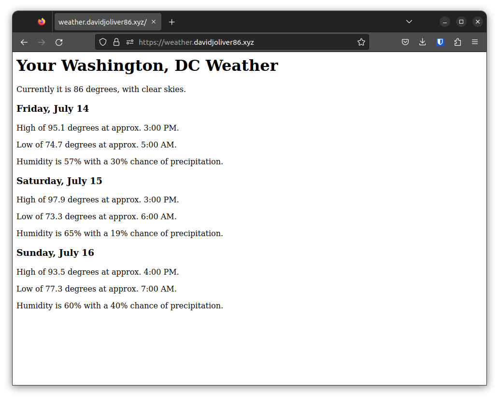

# Main assumptions

* I have my own domain at `davidjoliver86.xyz`. I deployed all my ingresses - Jenkins, Nginx, and the weather app to point to different subdomains.
* Because I do not want to accidentially tear down my domain's actual hosted zone, Terraform does not manage the hosted zone. It only uses data query references to it. If you own your own domain and want to replicate this setup, ensure your domain's NS records match that of your own Route53 hosted zone. Then you'll need to change every reference of `davidjoliver86.xyz` in the code.
* Tools I use (install the latest versions):
  * Git
  * Terraform
  * AWS CLI
  * Kubectl
  * Helm
* Everything except Terraform is also built into a publicly-available `build-tools` image: https://hub.docker.com/r/davidjoliver86/build-tools - these come in handy during the CI/CD job.
* You should have `curl` installed to execute the final task of kicking off the Jenkins build. I don't know why Ubuntu doesn't ship with it by default.

# IAM Roles for Service Accounts (IRSA)

https://github.com/kubernetes-sigs/external-dns/blob/master/docs/tutorials/aws.md

Where possible, I leverage the IAM Role for Service Account pattern. This satisfies the principle of least-privilege by allowing granular IAM access only to specific service accounts and pods that need it, as opposed to the general node groups' IAM role. Of course, there are still a few required IAM permissions for the node group role.

# Extracting the Jenkins admin password

In `terraform/roots/kubernetes`, run `terraform console` and execute the following command:
```
nonsensitive(module.jenkins.admin_password)
```

# Deployment walkthrough
## AWS Terraform

* Deploys a basic VPC with a combination of private and public subnets across two availability zones.
  * If this were an actual production environment, I'd want to use all possible zones if possible.
  * Includes an internet gateway and two NAT gateways.
  * Subnets are tagged with `kubernetes.role/<internal>-elb` so that the AWS LB Controller can place load balancers appropriately.
* Deploys the EKS cluster. The clusters need a mix of private and public subnets for all the load balancing to work. Standard IAM policies are attached to the cluster. The default IAM role could be exported if policies needed to be added to it (that apply to the entire cluster), but with IRSA, this was not necessary. The standard security group was also sufficient. The only security group rule added was to allow traffic between the node groups and the EFS file system for Jenkins.
* Deploys the node group. All nodes must reside in private subnets. Defaults to the standard Amazon Linux 2 AMI. Remote access wasn't needed, so it remains disabled. Standard IAM role with necessary permissions apply.

## Kubernetes Terraform

* Installs (with Helm) a driver for AWS EFS support and a StorageClass so that the persistent volume we need for Jenkins can be backed by EFS. Created an IRSA for the specific permissions it needs.
* Installs [ExternalDNS](https://github.com/kubernetes-sigs/external-dns) so that the cluster has permission to update Route53 records for load balancers and ingresses. Also needs its own role; solved with IRSA.
* Installs the AWS Load Balancer Controller for better integration with AWS-native resources for Ingresses. Ensured that it's the default Ingress class. Again, IRSA to the rescue.
* Deployed Nginx (nginx.davidjoliver86.xyz) - mainly as a "test" app for the cluster to ensure that the Ingress annotations work for proper SSL support.
* Deployed Jenkins. It was getting complex enough that I felt it could be better lived in its own module. Besides, it helps with being able to extract the admin password.
  * Speaking of the admin password - thanks to a combination of a few environment variables that were set in the cluster, we actually control the admin password saved as a Terraform secret. Normally we'd either have to extract it from the logs or as a file on the server. Do recall too that the backend S3 state is encrypted.

## Post-Terraform Jenkins Setup

* The `aws-auth` ConfigMap needs to be updated to allow the `ecr-ci` role access to the cluster as well. Jenkins is configured to use Kubernetes pods as the agents, and since the agents can have a service account, I used IRSA to be able to effectively "pass" an IAM role to the worker. By adding that IAM role to the `aws-auth` ConfigMap, the CI job can trigger the service rollout.
* The plugins and basic configuration were handled through `plugins.txt` and `casc.yaml` - the latter of which is Jenkins' configuration-as-code (JCasC). I have never actually done any Jenkins administration, so this realm is completely brand new to me. I found [this guide in DigitalOcean](https://www.digitalocean.com/community/tutorials/how-to-automate-jenkins-setup-with-docker-and-jenkins-configuration-as-code#step-2-installing-jenkins-plugins) to be very helpful.
* The pipeline job itself was taken from its folder from `/var/jenkins_home/jobs`. And yes, even though the token to trigger the build is visible, you'll still need to authenticate as the admin user to actually trigger the job remotely.
* After copying the Jenkins and job configurations to the server, I scale the service down and back up to force a new pod to reload the configuration. Because this is Jenkins, it takes quite a while for it to boot up, and then quite a while longer to actually be useful.
* The Jenkins admin password is also stored in the cluster as a secret. We can extract those values to get the auth required to kick off the build.
* Finally, kick off the build.

## Jenkins Build Steps

The goal of the build is to build the image, push the image to ECR, then restart the service.
1. The first step simply retrieves the latest commit SHA and writes it to a file. The reason is that the new image will have two tags: `latest`, and the commit SHA. That way we can have a one-to-one mapping of the image and the commit that it's based off of.
2. We use [Kaniko](https://github.com/GoogleContainerTools/kaniko) to build the image itself. We should be able to auth into AWS ECR because of the IRSA-supplied IAM role granting access to do so. Kaniko builds the image from the app's Dockerfile, then pushes it up with its two tags.
3. Another container manually applies the deployment, service, and ingress manifests for the weather app. While the certificate ARN can vary, the good news is that it's a wildcard certificate, so we should be able to use it for our weather app too. We basically extract it from the `nginx` ingress, use `sed` to patch the placeholder ARN, and apply that.
4. Finally, trigger the rollout by restarting the weather app deployment.

## The end result should look something like this:
